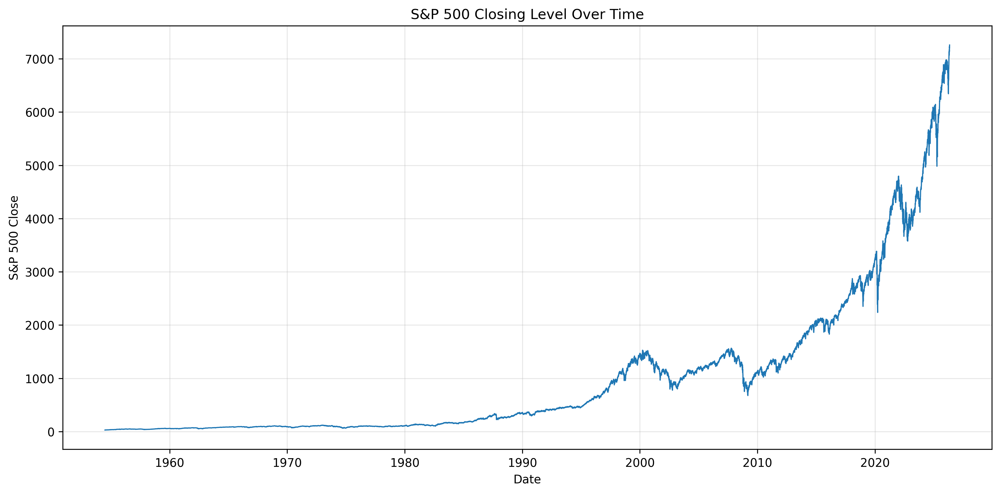
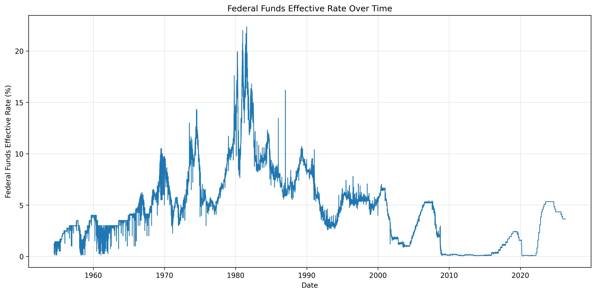
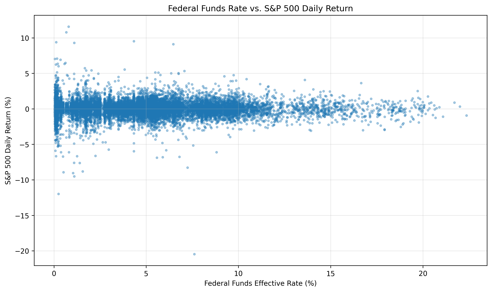
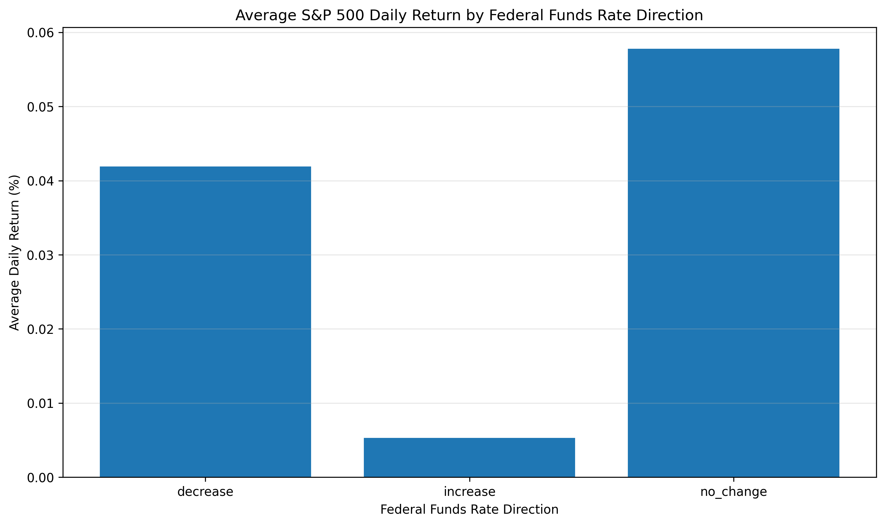

# Federal Funds Rate and S&P 500 Market Performance: A Reproducible Data Curation Project

---

## 1. Summary

This project examines the relationship between the Federal Funds Effective Rate and S&P 500 market performance through a reproducible data curation and exploratory analysis workflow. The motivation for the project comes from the broader financial question of how changes in short-term interest rate conditions relate to equity market behavior. Because the Federal Funds Rate is a major indicator of U.S. monetary policy and the S&P 500 is a widely used measure of U.S. stock market performance, integrating these two datasets provides a useful case for studying both financial patterns and data management challenges. At the same time, the project is not intended to make causal claims about monetary policy and stock returns. Instead, it focuses on building a transparent, reproducible workflow that collects, profiles, cleans, integrates, analyzes, and documents two complementary time-series datasets.

The project addresses three main questions. First, how can a calendar-day interest-rate dataset be integrated with a trading-day stock market dataset in a way that is methodologically clear and reproducible? Second, what data quality and completeness issues arise when aligning datasets with different temporal structures? Third, what descriptive patterns appear between Federal Funds Rate changes and S&P 500 daily returns in the integrated dataset?

The two data sources used in this project are the Federal Funds Effective Rate (`DFF`) from the Federal Reserve Bank of St. Louis FRED system and S&P 500 index data (`^GSPC`) acquired through Yahoo Finance using the `yfinance` Python package. The FRED dataset provides daily calendar-day observations of the Federal Funds Effective Rate, while the S&P 500 dataset provides trading-day observations of market prices and volume. This difference in temporal structure became the central curation challenge of the project. We preserved the raw data in `data/raw/`, generated cleaned versions in `data/processed/`, and created a final integrated dataset at `data/processed/integrated_fred_sp500.csv`.

Our integration strategy uses S&P 500 trading days as the reference timeline. This means that each row in the integrated dataset represents one market trading day, with the Federal Funds Rate matched to that same date. This approach creates a consistent observation unit for market analysis, but it also requires excluding non-trading-day Federal Funds Rate observations. We treat this not as a technical error but as a documented data curation trade-off between completeness and analytical consistency. The final integrated dataset contains 18,082 trading-day observations from 1954-07-01 through 2026-05-05.

The workflow is automated using Snakemake and is designed with both reproducibility and flexibility in mind. By default, the workflow runs in frozen mode using the raw data files included in the repository, allowing graders or future users to reproduce the submitted results without needing to reacquire data. An optional live mode allows the workflow to retrieve updated data, but this may produce different outputs because financial and economic datasets continue to update over time. To support transparency, the project includes checksum verification, data quality reports, cleaning documentation, integration summaries, analysis outputs, visualizations, a data dictionary, and machine-readable metadata.

The main analytical finding is that the same-day descriptive relationship between Federal Funds Rate changes and S&P 500 daily returns is limited. The visualizations and summary statistics show long-term movement in both interest rates and equity market levels, but the daily relationship between rate changes and stock returns is not strong enough to support simple causal interpretation. The project therefore contributes less as a predictive financial model and more as a complete example of data curation: it demonstrates how two reputable datasets can still require careful documentation, temporal alignment, quality assessment, and reproducible workflow design before meaningful analysis can be conducted.

---

## 2. Contributors

### Weimo Song

- [x] Data collection and acquisition, including the FRED and S&P 500 acquisition workflow (Week 4: Data Collection and Acquisition)
- [x] Storage and organization design for raw data, processed data, results, documentation, and metadata (Week 2: Data & Organization)
- [x] Data integration strategy using date-based schema matching and trading-day record-level alignment (Weeks 7–8: Data Integration and Record-level Integration)
- [x] Workflow automation and reproducibility design using Snakemake, frozen mode, and optional live mode (Weeks 13–14: Workflow Automation, Reproducibility, and Provenance)
- [x] Project plan revision and final report development with attention to course terminology and project documentation

### Andy Dong

- [x] Data quality profiling and interpretation of completeness, missingness, temporal coverage, and source-specific limitations (Week 10: Data Quality)
- [x] Data cleaning documentation and review of how cleaning decisions addressed identified quality issues (Weeks 11–12: Data Cleaning Methods)
- [x] Data analysis and visualization interpretation, including summary statistics, correlation results, and rate-change comparison
- [x] Metadata and data documentation, including data dictionary, project metadata, and FAIR-oriented documentation (Week 15: Metadata and Data Documentation)
- [x] Final report writing, findings interpretation, and overall documentation review for clarity and reproducibility

---

## 3. Storage and Organization

To support reproducibility, traceability, and ease of review, this repository separates raw data, processed data, scripts, results, figures, documentation, and metadata into clearly defined directories. This structure allows a reviewer to identify which files are original inputs, which files are generated outputs, and which scripts produce each stage of the workflow. The full repository structure is documented in [`docs/DATA_STRUCTURE.md`](docs/DATA_STRUCTURE.md), and a file-level inventory is available in [`docs/file_inventory.csv`](docs/file_inventory.csv).

The project uses the following high-level organization:

```text
Team-Accountants/
├── README.md                  # final project report
├── Snakefile                  # Snakemake workflow
├── requirements.txt           # required Python packages
├── pip_freeze.txt             # development environment package record
├── LICENSE                    # MIT license for project code
├── LICENSE-DOCUMENTATION.md   # CC BY 4.0 license for documentation
├── CITATION.cff               # citation metadata
├── scripts/                   # executable Python workflow scripts
├── data/
│   ├── raw/                   # original source-level data
│   └── processed/             # cleaned and integrated datasets
├── results/                   # generated tabular summaries and quality reports
├── figures/                   # generated visualizations
├── docs/                      # human-readable documentation
└── metadata/                  # machine-readable descriptive metadata
````

The [`data/raw/`](data/raw/) directory stores source-level data acquired from external providers. These files are preserved for provenance and should not be manually edited. Important raw files include [`data/raw/fred_dff_raw.json`](data/raw/fred_dff_raw.json), [`data/raw/fred_dff.csv`](data/raw/fred_dff.csv), [`data/raw/sp500_raw.csv`](data/raw/sp500_raw.csv), [`data/raw/CHECKSUMS.sha256`](data/raw/CHECKSUMS.sha256), and [`data/raw/acquisition_metadata.json`](data/raw/acquisition_metadata.json). Preserving both the FRED raw JSON response and normalized CSV files makes it possible to inspect the original acquisition output while also supporting tabular analysis.

The [`data/processed/`](data/processed/) directory stores derived datasets generated by scripts. These include the cleaned FRED file, the cleaned S&P 500 file, and the final integrated dataset: [`data/processed/integrated_fred_sp500.csv`](data/processed/integrated_fred_sp500.csv). Because these files are generated artifacts, they can be recreated from the raw files through the Snakemake workflow.

All executable workflow scripts are stored in [`scripts/`](scripts/). This includes acquisition, data quality profiling, cleaning, integration, analysis, visualization, metadata generation, and storage documentation scripts. The [`results/`](results/) directory stores machine-readable outputs such as checksum verification, quality summaries, cleaning summaries, integration checks, descriptive statistics, correlations, and rate-change analysis. The [`figures/`](figures/) directory stores visual outputs used in the final report.

The [`docs/`](docs/) directory stores human-readable documentation, including workflow instructions, the data dictionary, quality profile, cleaning provenance, integration summary, analysis summary, and visualization summary. The [`metadata/`](metadata/) directory stores [`metadata/metadata.json`](metadata/metadata.json), a machine-readable Schema.org / DCAT-style metadata file.

This separation between raw data, generated data, code, results, documentation, and metadata supports the data lifecycle principles emphasized in the course. It also makes the project easier to audit: raw files show what was acquired, scripts show how transformations were performed, processed files show intermediate and final datasets, and documentation explains the decisions made at each stage.

---

## 4. Data Profile

This project integrates two independent datasets that capture different aspects of the U.S. economic and financial system. From a data management perspective, both datasets are **secondary observational datasets**, meaning that we inherit the structure, schema design, data definitions, update practices, and data quality decisions made by the original providers. This matters because our project does not directly collect interest-rate or stock-market observations; instead, it curates existing authoritative datasets into a reproducible form that can support exploratory analysis.

Conceptually, the two datasets represent different but related entities:

- **Monetary policy conditions**, represented by the Federal Funds Effective Rate
- **Stock market performance**, represented by S&P 500 index prices and returns

Both datasets are structured as **time-series relations**, where each row represents an observation at a specific date and each column represents an attribute of that observation. Their shared temporal attribute allows them to be linked at the schema level. However, the meaning of a “daily” observation differs between the two sources: the Federal Funds Rate is reported on a calendar-day basis, while S&P 500 market data exists only for trading days. This temporal difference is the central data curation challenge of the project.

The project repository preserves each stage of the data lifecycle. Raw source data are stored in [`data/raw/`](data/raw/), cleaned datasets are stored in [`data/processed/`](data/processed/), documentation is stored in [`docs/`](docs/), and machine-readable project metadata is stored in [`metadata/metadata.json`](metadata/metadata.json). The final integrated dataset used for analysis is [`data/processed/integrated_fred_sp500.csv`](data/processed/integrated_fred_sp500.csv).

### Dataset 1: Federal Funds Effective Rate from FRED

The first dataset contains historical values of the **Federal Funds Effective Rate**, retrieved from the [Federal Reserve Economic Data (FRED)](https://fred.stlouisfed.org/) system maintained by the Federal Reserve Bank of St. Louis. The specific FRED series used in this project is `DFF`, which reports the effective federal funds rate as a daily interest-rate series.

Key characteristics:

- **Source:** Federal Reserve Bank of St. Louis, FRED
- **Series:** `DFF`
- **Dataset type:** Secondary observational data
- **Acquisition method:** Programmatic API-based acquisition using Python
- **Frequency:** Daily calendar-day observations
- **Temporal coverage in current project files:** July 1954 through May 2026
- **Primary raw files:**
  - [`data/raw/fred_dff_raw.json`](data/raw/fred_dff_raw.json)
  - [`data/raw/fred_dff.csv`](data/raw/fred_dff.csv)
- **Cleaned file:**
  - [`data/processed/fred_dff_clean.csv`](data/processed/fred_dff_clean.csv)

The FRED dataset has a relatively simple schema. In its normalized CSV form, the primary attributes are the observation date and the Federal Funds Effective Rate value. The `date` field functions as the temporal key, while the rate value represents the measured interest-rate condition for that date. The value is expressed as a percentage. Because the series is daily and calendar-based, observations may exist for weekends and holidays, even when the U.S. stock market is closed.

For this project, the FRED dataset represents the monetary policy and short-term interest-rate environment. It allows us to examine how the interest-rate context changes over time and how rate changes can be aligned with stock market observations. The dataset is especially important because it begins in 1954, which determines the start of the overlapping temporal coverage in the integrated dataset. Although S&P 500 data is available earlier, those earlier market observations cannot be integrated with the Federal Funds Rate because the FRED `DFF` series does not cover that period.

From an ethical and legal perspective, the FRED dataset creates minimal risk. It contains aggregate macroeconomic data rather than individual-level records, so there are no privacy or confidentiality concerns. The main legal and ethical responsibility is proper attribution to the Federal Reserve Bank of St. Louis and responsible use of the data. We cite FRED in the project references and preserve the source identity in both human-readable documentation and machine-readable metadata. The project also stores a raw JSON response to preserve source-native structure and a normalized CSV file to support reproducible analysis.

### Dataset 2: S&P 500 Market Data from Yahoo Finance

The second dataset contains historical S&P 500 index data from [Yahoo Finance](https://finance.yahoo.com/), accessed through the `yfinance` Python package. The S&P 500 index is represented by the ticker `^GSPC`. This dataset provides daily market observations for trading sessions and is used as the main measure of U.S. equity market performance.

Key characteristics:

- **Source:** Yahoo Finance
- **Index ticker:** `^GSPC`
- **Dataset type:** Secondary observational data
- **Acquisition method:** Programmatic acquisition through the `yfinance` Python package
- **Frequency:** Daily trading-day observations
- **Temporal coverage in current project files:** December 1927 through May 2026
- **Primary raw file:**
  - [`data/raw/sp500_raw.csv`](data/raw/sp500_raw.csv)
- **Cleaned file:**
  - [`data/processed/sp500_clean.csv`](data/processed/sp500_clean.csv)

The S&P 500 dataset has a more complex schema than the FRED dataset because each row includes multiple market attributes for a trading day. The raw data includes date, opening price, high price, low price, closing price, adjusted closing price, and trading volume. These fields describe the behavior of the index during each trading session. For this project, the most important price attribute is the closing value because it represents the final market level at the end of the trading day and is commonly used to compute daily returns.

The S&P 500 dataset differs conceptually from the FRED dataset because observations only exist when markets are open. Weekends, exchange holidays, and other non-trading days do not have S&P 500 observations. Therefore, the `Date` field does not represent a continuous calendar-day sequence. It represents a sequence of trading days. This distinction is central to the project because it means that a direct one-to-one daily merge with FRED would be misleading unless the observation unit is clearly defined.

For our research questions, the S&P 500 dataset represents stock market performance. It provides the market outcome variables used in the analysis, including closing index level, simple daily return, and log daily return. These derived return measures allow us to compare market movement with Federal Funds Rate changes on the same trading-day timeline.

The ethical risks associated with the S&P 500 dataset are also low because the data consists of public financial market information and contains no personal or confidential records. However, the project still needs to handle licensing and terms-of-use issues carefully. Yahoo Finance data is accessed through `yfinance`, and users should respect the provider’s terms and cite both Yahoo Finance and the software tools used to retrieve the data. In this repository, the raw data file is included to support reproducibility for the submitted project, while the workflow also provides an optional live mode for reacquiring current data when permitted.

### Integrated Dataset

The final analysis-ready dataset is stored at [`data/processed/integrated_fred_sp500.csv`](data/processed/integrated_fred_sp500.csv). It integrates the cleaned FRED and S&P 500 datasets through their shared date attribute. The integrated dataset contains one row per S&P 500 trading day within the overlapping period covered by the Federal Funds Rate. In the current project files, the integrated dataset contains **18,082 observations** from **1954-07-01 through 2026-05-05**.

The integration design uses the S&P 500 dataset as the reference relation. This means that the unit of observation in the final dataset is not “one calendar day,” but rather “one S&P 500 trading day.” For each trading day, the workflow matches the Federal Funds Rate observation from the same date. This strategy is appropriate for the project because stock returns can only be calculated for trading sessions. If the workflow instead used all FRED calendar days as the base timeline, many rows would have missing market prices and returns because markets are closed on weekends and holidays.

The integrated dataset includes both original and derived variables. Important variables include:

- `date`: the shared temporal key and final observation date
- `federal_funds_rate`: the Federal Funds Effective Rate for the trading date
- `federal_funds_rate_change`: change in the Federal Funds Rate from the previous integrated trading-day observation
- `federal_funds_rate_direction`: categorical direction of the rate change
- `sp500_close`: S&P 500 closing index level
- `sp500_daily_return`: simple daily return based on closing prices
- `sp500_log_return`: log return based on closing prices
- `sp500_zero_volume_flag`: flag for source records with zero reported volume

This integrated structure directly supports the project’s research questions. It allows us to examine how Federal Funds Rate levels and changes align with S&P 500 trading-day returns. At the same time, the integrated dataset also makes the project’s main data curation trade-off explicit: non-trading-day FRED observations are excluded because they do not correspond to market observations. This is a completeness trade-off, but it creates a consistent observation unit for analysis.

Additional documentation for the integrated dataset is available in [`docs/data_dictionary.md`](docs/data_dictionary.md), [`docs/INTEGRATION_SUMMARY.md`](docs/INTEGRATION_SUMMARY.md), and [`metadata/metadata.json`](metadata/metadata.json). Together, these files describe the dataset structure, variable definitions, integration logic, temporal coverage, and source relationships. This documentation supports interpretability, transparency, and reuse by future users.

---

## 5. Data Quality

Data quality assessment was an important stage of this project because the two datasets appear simple at first glance but differ substantially in their temporal structure. The quality assessment was implemented in [`scripts/data_quality.py`](scripts/data_quality.py), which evaluates the raw input files before any cleaning or integration occurs. The script reads files from [`data/raw/`](data/raw/) and generates both machine-readable and human-readable outputs, including [`results/data_quality_summary.csv`](results/data_quality_summary.csv), [`results/missingness_summary.csv`](results/missingness_summary.csv), [`results/date_coverage_summary.csv`](results/date_coverage_summary.csv), [`results/schema_summary.csv`](results/schema_summary.csv), [`results/temporal_alignment_profile.csv`](results/temporal_alignment_profile.csv), [`results/checksum_verification.csv`](results/checksum_verification.csv), and [`docs/data_quality_profile.md`](docs/data_quality_profile.md).

The quality assessment focused on several dimensions: file integrity, schema consistency, date validity, duplicate records, missing values, numeric validity, temporal coverage, and cross-dataset alignment. We also used SHA-256 checksum verification to confirm that the raw files matched the expected versions stored in the repository. This is important because the project supports both a frozen workflow and an optional live workflow. In the default frozen mode, reproducibility depends on using the exact raw files included in the repository. The checksum verification results showed that all available raw-file checksums matched their expected values, which supports the integrity of the submitted data package.

### Federal Funds Effective Rate Quality Findings

The FRED Federal Funds Effective Rate dataset showed strong quality as a raw calendar-day time series. The raw FRED file, [`data/raw/fred_dff.csv`](data/raw/fred_dff.csv), contains 26,242 rows and 4 columns, with a date range from 1954-07-01 to 2026-05-05. The dataset contains 26,242 unique dates, which means every row corresponds to a unique date. The profiling script found zero missing calendar dates between the minimum and maximum date, zero duplicate date rows, zero invalid date rows, zero missing core value rows, and zero non-numeric core value rows.

The Federal Funds Rate value range is from 0.04 to 22.36, which is plausible for the historical period covered by the dataset. The dataset also contains 7,498 weekend observations. These observations are not data errors. Instead, they reflect the fact that the FRED series is structured as a calendar-day interest-rate series. This is a key distinction because calendar-day completeness in FRED does not mean that the observations can be directly aligned with stock market data on every date. Weekend and holiday observations are valid for the interest-rate series, but they do not correspond to S&P 500 trading observations.

The main limitation of the FRED dataset is temporal coverage. The series begins in 1954, which means that any integrated analysis with the S&P 500 must begin no earlier than 1954 if both datasets are required. Therefore, FRED determines the start date of the overlapping integrated dataset, even though S&P 500 market data is available for earlier years.

### S&P 500 Quality Findings

The S&P 500 dataset also showed strong quality, but its structure differs from the FRED dataset. The raw S&P 500 file, [`data/raw/sp500_raw.csv`](data/raw/sp500_raw.csv), contains 24,703 rows and 7 columns, with a date range from 1927-12-30 to 2026-05-06. The dataset contains 24,703 unique dates, zero duplicate date rows, zero invalid date rows, zero missing core value rows, and zero non-numeric core value rows. The closing index value ranges from approximately 4.40 to 7,365.12.

Unlike the FRED dataset, the S&P 500 dataset is a trading-day time series. The profiling script found 11,220 missing calendar dates between the minimum and maximum date, but these gaps are expected because the stock market is closed on weekends and holidays. The dataset has zero weekend observations, which confirms that the date sequence follows a market trading schedule rather than a full calendar schedule. For this reason, missing calendar dates in the S&P 500 dataset should not be treated as ordinary missing data.

One source-specific issue is the presence of 5,497 zero-volume rows. These appear primarily in older historical observations. Because our analysis focuses on closing prices and derived returns rather than trading volume as a primary analytical variable, we did not treat these rows as invalid records. Instead, we documented them and preserved a zero-volume flag so that users can identify these observations if they conduct future volume-based analysis. This decision avoids unnecessary deletion of historical market records while still making the limitation transparent.

### Cross-Dataset Alignment Quality

The most important data quality issue in this project is not missingness within either individual dataset, but alignment between the two datasets. The FRED dataset contains 26,242 unique calendar dates, while the S&P 500 dataset contains 24,703 unique trading dates. The raw datasets share 18,082 overlapping dates. There are 8,160 FRED-only dates and 6,621 S&P 500-only dates. Most of the S&P 500-only dates occur before the FRED series begins, with 6,620 S&P 500 observations falling before the 1954 start date of the Federal Funds Rate series. The overlapping date range is 1954-07-01 to 2026-05-05.

This profile confirms the central curation challenge of the project: both datasets contain a date field, but the date fields do not represent the same observation schedule. FRED is complete by calendar day, while the S&P 500 is complete by trading day. Therefore, a simple daily merge without considering observation units would produce misleading conclusions about missingness and completeness.

To address this issue, we use S&P 500 trading days as the base timeline for the integrated dataset. This choice is appropriate because stock returns only exist on trading days. We do not invent market observations for weekends or holidays, and we do not treat FRED-only weekend dates as failed matches. Instead, we document the excluded FRED-only dates as an expected consequence of aligning a calendar-day macroeconomic series with a trading-day financial market series. This creates a transparent trade-off: the integrated dataset sacrifices full calendar-day completeness in order to maintain a consistent and analytically meaningful trading-day observation unit.

Overall, the quality assessment shows that both raw datasets are reliable enough for integration and exploratory analysis. The major quality concern is not source unreliability, but temporal heterogeneity. By documenting this issue before cleaning and integration, the project makes the later workflow decisions traceable and reproducible.

---

## 6. Data Cleaning

The data cleaning stage transformed the raw FRED and S&P 500 files into standardized, analysis-ready datasets while preserving the original raw files for provenance. The cleaning workflow is implemented in [`scripts/data_cleaning.py`](scripts/data_cleaning.py). This script runs after raw data quality profiling and before integration. It reads only from [`data/raw/`](data/raw/) and writes cleaned outputs to [`data/processed/`](data/processed/), which ensures that the raw source data are never manually edited or overwritten.

The main cleaning outputs are:

- [`data/processed/fred_dff_clean.csv`](data/processed/fred_dff_clean.csv)
- [`data/processed/sp500_clean.csv`](data/processed/sp500_clean.csv)
- [`results/cleaning_summary.csv`](results/cleaning_summary.csv)
- [`results/cleaning_decisions.csv`](results/cleaning_decisions.csv)
- [`docs/cleaning_provenance.md`](docs/cleaning_provenance.md)

The cleaning process was guided by the raw data quality profile. Because the profile did not identify severe defects such as duplicate dates, invalid dates, or missing core values, the cleaning strategy focused on standardization, validation, documentation, and preparation for integration rather than aggressive row deletion. This approach is appropriate for the project because both sources are authoritative, and the main curation challenge is temporal alignment rather than major raw data corruption.

### Federal Funds Effective Rate Cleaning

The FRED cleaning process starts with [`data/raw/fred_dff.csv`](data/raw/fred_dff.csv) and produces [`data/processed/fred_dff_clean.csv`](data/processed/fred_dff_clean.csv). The raw FRED dataset contains 26,242 rows, and the cleaned dataset also contains 26,242 rows. No rows were removed during cleaning. The cleaned date range is 1954-07-01 to 2026-05-05.

The first cleaning operation standardizes column names to lowercase `snake_case`. This improves consistency with the S&P 500 cleaned file and makes the downstream integration script easier to read and maintain. The raw FRED rate column is then renamed from `value` to `federal_funds_rate`, which makes the meaning of the variable explicit. This is especially important in the integrated dataset, where generic variable names could become ambiguous.

The script then parses the `date` column as a date field and converts `federal_funds_rate` to a numeric type. These operations address potential syntactic issues that could interfere with integration or analysis. Even though the quality profile found no invalid dates, missing core values, or non-numeric core values, the cleaning script still checks for these problems so that the workflow remains robust if the data are reacquired in live mode.

The cleaning process also removes duplicate dates if they are present. In the submitted dataset, there were zero duplicate date rows before cleaning and zero after cleaning. This confirms that the FRED dataset already behaves like a well-formed time-series relation with one observation per calendar date.

One important cleaning decision was to retain weekend observations. The FRED series is a calendar-day interest-rate dataset, so weekend observations are expected and should not be treated as errors. Removing them during cleaning would incorrectly alter the structure of the source dataset. Instead, the project preserves the complete calendar-day FRED series and handles temporal alignment later during the integration step. The script also drops `realtime_start` and `realtime_end` from the cleaned analysis file because they are not needed for date-based integration, while preserving them in the raw file for provenance.

### S&P 500 Cleaning

The S&P 500 cleaning process starts with [`data/raw/sp500_raw.csv`](data/raw/sp500_raw.csv) and produces [`data/processed/sp500_clean.csv`](data/processed/sp500_clean.csv). The raw S&P 500 dataset contains 24,703 rows, and the cleaned dataset also contains 24,703 rows. No rows were removed during cleaning. The cleaned date range is 1927-12-30 to 2026-05-06.

As with the FRED dataset, the first step is to standardize column names to lowercase `snake_case`. The script then renames price and volume fields with clear `sp500_` prefixes. This prevents confusion after integration and makes it clear which variables originate from the market dataset. For example, closing price and volume are represented with S&P-specific names rather than generic names.

The script parses the `date` column as a date field and converts price and volume fields to numeric types. These steps ensure that the dataset can support return calculations, sorting, validation, and date-based merging. The script also checks for invalid dates, missing core values, non-numeric values, and duplicate dates. In the submitted dataset, each of these issues had a count of zero, so no records were removed for these reasons.

The most important S&P 500-specific issue is the presence of 5,497 zero-volume rows in older historical records. Instead of removing these rows, the cleaning script retains them and adds a `sp500_zero_volume_flag`. This decision reflects the project’s analytical focus. Since our main analysis uses closing prices and derived returns rather than volume as a primary variable, deleting zero-volume rows would unnecessarily reduce historical coverage. At the same time, flagging these rows makes the issue transparent for future users who may want to perform volume-based analysis.

The cleaning script also does not fill missing calendar dates in the S&P 500 dataset. These gaps are expected because the stock market does not trade on weekends and holidays. Filling those dates would create artificial market observations and could distort daily return analysis. For the same reason, the project does not forward-fill market prices during cleaning.

### Imputation and Provenance

No imputation is performed during the cleaning stage. The workflow does not invent stock market observations for non-trading days, does not fill weekend or holiday gaps, and does not forward-fill S&P 500 prices. This decision keeps the cleaned datasets close to their source structure and avoids introducing assumptions before integration.

All cleaning decisions are documented in [`results/cleaning_decisions.csv`](results/cleaning_decisions.csv), while [`docs/cleaning_provenance.md`](docs/cleaning_provenance.md) provides a human-readable explanation of the cleaning process. Together, these files make the cleaning stage transparent and reproducible. The cleaned datasets are then passed to the integration step, where both files share a standardized ISO-format `date` field and can be aligned using S&P 500 trading days as the base timeline.

---

## 7. Data Integration

The data integration stage combines the cleaned Federal Funds Effective Rate dataset and the cleaned S&P 500 dataset into a single analysis-ready time-series relation. This step is implemented in [`scripts/data_integration.py`](scripts/data_integration.py), which runs after raw data quality profiling and data cleaning. The integration script reads [`data/processed/fred_dff_clean.csv`](data/processed/fred_dff_clean.csv) and [`data/processed/sp500_clean.csv`](data/processed/sp500_clean.csv), then produces [`data/processed/integrated_fred_sp500.csv`](data/processed/integrated_fred_sp500.csv), [`results/integration_summary.csv`](results/integration_summary.csv), [`results/integration_quality_checks.csv`](results/integration_quality_checks.csv), and [`docs/INTEGRATION_SUMMARY.md`](docs/INTEGRATION_SUMMARY.md).

The integration key is `date`. At first, this appears straightforward because both cleaned datasets contain an ISO-formatted date field. However, the project involves both **schema-level integration** and **record-level integration**, and the existence of a shared date attribute does not eliminate the need for explicit integration decisions. The two datasets exhibit **schema heterogeneity** because their original column names, variable meanings, and observational structures differ. They also exhibit a **temporal granularity mismatch** because FRED is a calendar-day interest-rate series, while the S&P 500 is a trading-day market series. Therefore, a direct join without considering the observation schedule would produce misleading assumptions about missingness and completeness.

The integration workflow follows a structured data integration process. First, **schema matching** aligns the date field in the FRED dataset with the date field in the S&P 500 dataset. Second, **schema mapping** defines a compact integrated schema containing only the variables needed for downstream analysis and visualization. Third, both datasets are transformed into a common tidy format with standardized names and date types. Finally, **record-level integration** is performed by joining records on the shared `date` field after preprocessing and cleaning.

The project defines the S&P 500 dataset as the **reference relation**. This means the final integrated dataset uses one row per S&P 500 trading day as its observation unit. This design is appropriate because the analysis focuses on daily stock market performance, and stock returns only exist when the market is open. For each in-range S&P 500 trading day, the workflow attaches the Federal Funds Rate observed on the same date. This is a rule-based data fusion strategy: market trading dates are retained, corresponding interest-rate observations are assigned to those dates, and non-trading-day FRED observations are excluded from the final analysis table.

This decision creates a controlled **completeness reduction**. The cleaned FRED dataset contains 26,242 rows, while the cleaned S&P 500 dataset contains 24,703 rows. The S&P 500 data begins in 1927, but the FRED `DFF` series begins in 1954, so the integration script removes 6,620 S&P 500 rows that predate the Federal Funds Rate series and 1 S&P 500 row after the current FRED end date. After restricting the S&P 500 data to the FRED date range, 18,082 S&P 500 trading-day observations remain. The final integrated dataset contains 18,082 rows covering 1954-07-01 through 2026-05-05.

The integration quality checks show that the merge succeeded for all in-range S&P 500 trading dates. There are 0 unmatched rows after the merge, 0 missing Federal Funds Rate values after the merge, and 0 missing S&P 500 close values after the merge. The merge success rate within the FRED date range is 1.000000. This confirms that the integration strategy produces a complete trading-day analysis table within the defined overlapping population.

The final integrated dataset keeps the following variables:

- `date`
- `sp500_close`
- `sp500_daily_return`
- `sp500_log_return`
- `sp500_zero_volume_flag`
- `federal_funds_rate`
- `federal_funds_rate_change`
- `federal_funds_rate_direction`

The original S&P 500 `open`, `high`, `low`, adjusted close, and volume fields are preserved in the raw and cleaned files, but they are not retained in the compact integrated dataset because the planned analysis focuses on closing index levels, daily returns, interest-rate levels, and rate-change direction.

This integration design involves important trade-offs. It loses some temporal completeness by excluding FRED-only calendar dates, imposes a market-centric definition of time, and simplifies the relationship between interest-rate conditions and market responses to same-date alignment. However, it also creates a dataset that is **fit for use** for the project’s descriptive trading-day analysis. Most importantly, the workflow documents this decision as a transparent curation choice rather than treating unmatched dates as errors. The resulting dataset supports reproducible analysis while preserving the logic and limitations of the integration process.

---

## 8. Data Analytics and Findings

The analysis stage uses the final integrated dataset, [`data/processed/integrated_fred_sp500.csv`](data/processed/integrated_fred_sp500.csv), to conduct a descriptive exploration of how Federal Funds Rate conditions align with S&P 500 trading-day performance. This stage is implemented through [`scripts/analyze_data.py`](scripts/analyze_data.py) and [`scripts/visualize_data.py`](scripts/visualize_data.py). The analysis outputs are stored in [`results/`](results/), while the generated figures are stored in [`figures/`](figures/). Consistent with the project’s data curation focus, the analysis is exploratory rather than causal. The goal is not to prove that interest-rate changes cause market returns, but to summarize observable patterns in the integrated dataset.

The final integrated dataset contains **18,082 trading-day observations** from **1954-07-01 to 2026-05-05**. The first valid S&P 500 daily return appears on 1954-07-02 because return calculation requires a prior closing value. Over the integrated period, the S&P 500 closing level increased from approximately **29.21** on the first integrated observation to approximately **7,259.22** on the final integrated observation, representing a total return of about **24,751.83%**. The average daily S&P 500 return is **0.0356%**, with a daily return standard deviation of **1.0089%**. These values show the long-run upward trend of the market as well as substantial day-to-day volatility.



The Federal Funds Rate shows a very different pattern. Instead of a long-run upward trend, the rate fluctuates across monetary policy regimes. In the integrated dataset, the minimum Federal Funds Rate is **0.04%**, the maximum is **22.36%**, and the average is **4.6001%**. The time-series visualization shows especially high interest-rate periods around the late 1970s and early 1980s, followed by lower-rate environments in later decades. This supports one of the main conceptual points of the project: the interest-rate series and the equity-market series are related through time but describe different economic phenomena.



The correlation results suggest that the same-day relationship between Federal Funds Rate variables and S&P 500 daily returns is weak. The Pearson correlation between the Federal Funds Rate level and S&P 500 daily return is **-0.014536**. The correlation between Federal Funds Rate daily change and S&P 500 daily return is similarly small at **-0.014845**. These values are close to zero, indicating that simple same-day linear association is limited. The scatter plot reinforces this point: daily returns are widely dispersed across different rate levels, with no strong visible linear pattern.



We also grouped observations by Federal Funds Rate direction. On rate-decrease days, the average S&P 500 daily return is **0.0419%**, with a positive-return share of **52.12%**. On rate-increase days, the average daily return is lower at **0.0053%**, with a positive-return share of **52.33%**. On no-change days, the average daily return is **0.0578%**, with a positive-return share of **54.76%**. Although these differences are descriptively interesting, they should be interpreted cautiously because rate changes are not randomly assigned and same-day market returns may reflect expectations, macroeconomic news, and broader market conditions.



Overall, the findings show that the project successfully produces a clean, integrated, and reproducible dataset for studying monetary-policy conditions and market performance. However, the descriptive results do not support a simple causal interpretation. More rigorous analysis would require lag structures, event-window methods, macroeconomic controls, and attention to policy expectations.

---

## 9. Future Work

This project creates a reproducible foundation for integrating the Federal Funds Effective Rate with S&P 500 market performance, but several future extensions could improve the analytical depth, data curation rigor, and lifecycle completeness of the work. The current project is intentionally descriptive. It demonstrates how two secondary time-series datasets can be acquired, profiled, cleaned, integrated, analyzed, and documented. Future work could build on this foundation by improving both the economic analysis and the data management workflow.

### 1. Expanding the Analytical Design Beyond Same-Day Relationships

The current analysis focuses on same-day alignment between Federal Funds Rate variables and S&P 500 daily returns. This is useful for a first exploratory analysis, but it is limited because financial markets often respond to expectations before official rate changes occur. By the time the Federal Funds Rate changes, market participants may have already anticipated the policy shift. As a result, same-day correlations may understate or misrepresent the relationship between monetary policy and stock market behavior.

Future work could incorporate **lag structures** and **event-window analysis**. For example, the analysis could examine S&P 500 returns one day, five days, ten days, or one month after Federal Funds Rate changes. Another extension would be to focus on Federal Open Market Committee announcement dates instead of daily rate changes. This would better align the data model with the real-world mechanism through which monetary policy information reaches financial markets. Such an approach would move the project closer to a more meaningful conceptual model of policy response while still requiring careful documentation of assumptions.

### 2. Adding More Data Sources for Context

A major limitation of the current project is that it integrates only two datasets. While this satisfies the project requirement and provides a clean curation case, the relationship between interest rates and stock market returns is shaped by many other macroeconomic and financial variables. Future work could expand the data lifecycle by adding additional datasets such as inflation rates, unemployment rates, GDP growth, Treasury yields, recession indicators, volatility indexes, or Federal Reserve announcement dates.

Adding these sources would create a richer **multi-source integration problem**. It would also introduce additional schema-level and record-level integration challenges, such as monthly versus daily frequency, different release calendars, and revised versus real-time economic data. This would allow future versions of the project to apply more advanced data lifecycle concepts, especially around temporal granularity, provenance, and source comparability. For example, monthly inflation data would require a rule for mapping monthly values to daily trading observations, and that rule would need to be documented as a data fusion decision rather than treated as a neutral technical step.

### 3. Improving Conceptual Alignment Between Data and Real-World Phenomena

Another important future direction is refining the relationship between the conceptual model and the data model. In the current project, the Federal Funds Rate is used as a proxy for monetary policy conditions, and S&P 500 returns are used as a proxy for market performance. These are reasonable choices, but they simplify complex real-world phenomena. Monetary policy includes expectations, forward guidance, balance sheet actions, and communication effects, not only the effective federal funds rate. Similarly, stock market performance can be measured through returns, volatility, sector-level changes, valuation measures, or risk-adjusted performance.

Future work could make these conceptual relationships more explicit by defining entities, attributes, and relationships before selecting variables. For example, instead of treating “interest rate” as a single variable, a future version could distinguish between policy level, policy change, expected change, and surprise change. This would improve the project’s semantic clarity and make the integrated dataset more fit for specific analytical purposes.

### 4. Strengthening Reproducibility and Provenance

The current workflow already includes Snakemake automation, frozen mode, optional live mode, checksum verification, `requirements.txt`, `pip_freeze.txt`, and machine-readable metadata. However, future work could further strengthen reproducibility by adding automated validation tests and continuous integration. For example, GitHub Actions could run a lightweight version of the workflow whenever scripts are updated, checking that all expected outputs are generated and that key row counts and date ranges remain consistent.

Another improvement would be containerization through Docker. A Dockerfile would preserve not only Python package versions but also the broader computational environment. This would address a deeper reproducibility concern: even when package versions are recorded, operating system differences and dependency resolution can still affect execution. A containerized workflow would make the project easier to reproduce across machines.

### 5. Improving Metadata and FAIR Documentation

The project already includes [`metadata/metadata.json`](metadata/metadata.json), [`docs/data_dictionary.md`](docs/data_dictionary.md), and workflow documentation. Future work could make the metadata more complete by adding more detailed provenance fields, variable-level source lineage, and formal versioning. For example, each generated dataset could include metadata describing which script created it, which input files were used, when it was generated, and what checksum identifies it.

A further step would be publishing the final release through a persistent identifier service such as Zenodo. This would improve the findability and citability of the project. It would also better support FAIR principles by linking the code, data, documentation, and metadata to a stable archival record.

### 6. Developing More Robust Statistical Models

Finally, future work could move beyond descriptive statistics toward more rigorous modeling. Possible methods include regression with lagged variables, regime-based analysis, rolling-window correlations, or event-study designs. These models could test whether the relationship between interest-rate conditions and market performance differs across monetary policy regimes, recession periods, or high-volatility environments.

However, any advanced model would still depend on careful data curation. The main lesson from this project is that analysis quality depends on lifecycle quality. Before making stronger claims, future work would need to improve conceptual modeling, integration logic, provenance tracking, and documentation. In that sense, this project provides a reproducible base layer for future financial data analysis rather than a final answer about monetary policy and the stock market.

---

